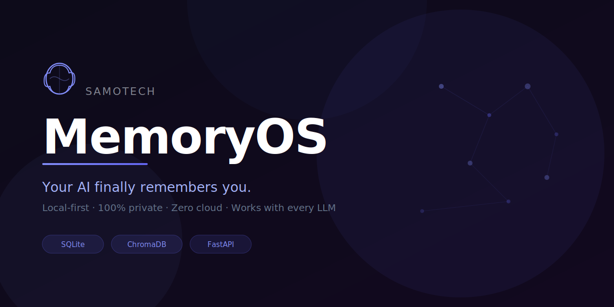

<div align="center">


# 🧠 MemoryOS



### *Your AI finally remembers you.*

> Local-first AI memory layer. 100% private. Zero cloud. Works with every LLM.

---

[](LICENSE)
[](https://python.org)
[](https://fastapi.tiangolo.com)
[](https://nextjs.org)
[](https://typescriptlang.org)
[](https://github.com/SamoTech/memoryos/actions)
[](https://github.com/SamoTech/memoryos/releases)
[](https://github.com/SamoTech/memoryos/stargazers)
[](https://github.com/SamoTech/memoryos/network/members)
[](https://github.com/SamoTech/memoryos/issues)
[](https://github.com/SamoTech/memoryos/pulls)
[](https://sqlite.org)
[](https://trychroma.com)
[](https://ollama.ai)
[](docker-compose.yml)
[](https://github.com/SamoTech)

</div>

---

## 😐 The Problem

You use ChatGPT, Claude, Cursor, and Gemini **every single day**. But every new session starts from **absolute zero**.

**This is the AI amnesia problem. MemoryOS fixes it.**

---

## ✨ How It Works

```
1. CAPTURE   →   Extension watches your AI chats (ChatGPT, Claude, Gemini)
2. STORE     →   Local SQLite + ChromaDB — 100% on your machine
3. RETRIEVE  →   Hybrid search: semantic + keyword, injected into any AI chat
```

---

## ⚡ Quick Install

```bash
# One-line (Linux / macOS)
curl -fsSL https://raw.githubusercontent.com/SamoTech/memoryos/main/scripts/install.sh | bash

# Via pip
pip install memoryos && memoryos start

# Via Docker
git clone https://github.com/SamoTech/memoryos && cd memoryos && docker-compose up -d
```

---

## 💻 CLI Reference

```bash
memoryos start                          # Start server + open dashboard
memoryos add "Decided to use Zustand"   # Add memory manually
memoryos search "react hooks"           # Semantic search
memoryos ask "what auth approach did I use?"  # Get AI-ready context
memoryos export --format markdown       # Export to Markdown
```

---

## ⚙️ Configuration

Edit `~/.memoryos/.env`:

```env
EMBEDDING_PROVIDER=local
SUMMARIZER_PROVIDER=ollama
OLLAMA_MODEL=llama3
AUTO_SUMMARIZE=true
```

---

## 🛠 Tech Stack

| Layer | Technology |
|---|---|
| Backend | Python 3.11, FastAPI |
| Database | SQLite + FTS5 |
| Vector DB | ChromaDB |
| Embeddings | sentence-transformers |
| Summarization | Ollama / Groq / OpenAI |
| Dashboard | Next.js 14 + TypeScript |
| Extension | Chrome MV3 |

---

## 📄 License

MIT — see [LICENSE](LICENSE) for details.

---

<div align="center">

Built with ❤️ by [SamoTech](https://github.com/SamoTech) · *Local-first AI memory*

</div>
